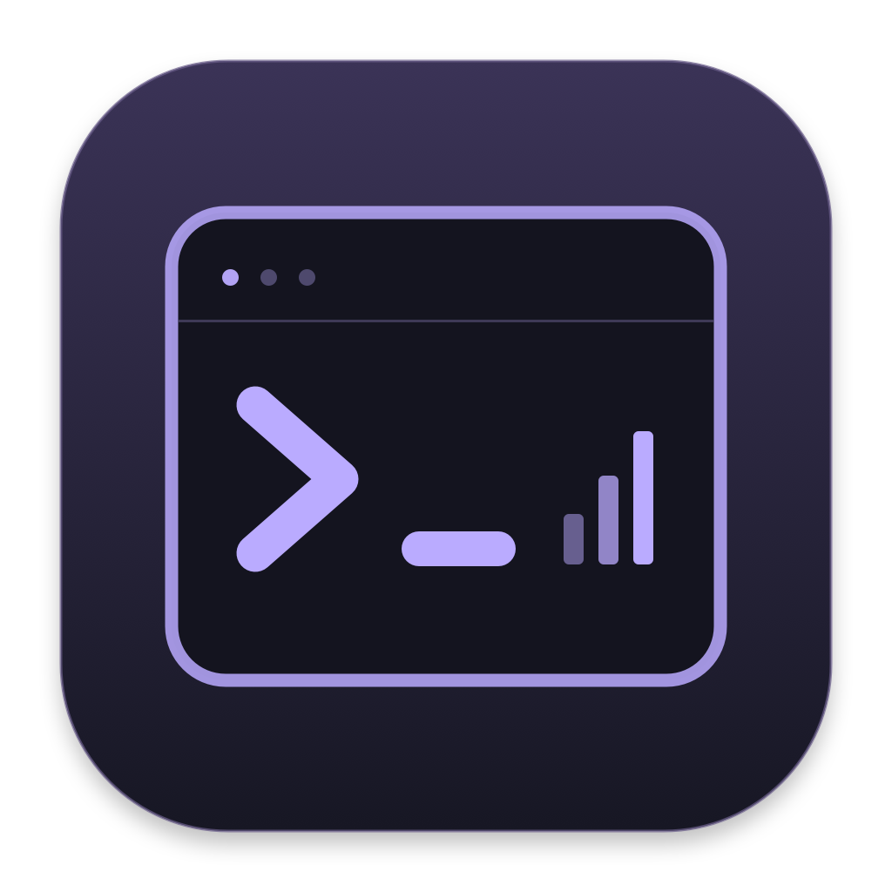
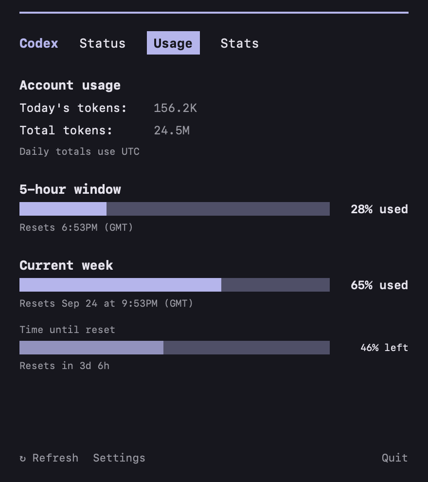
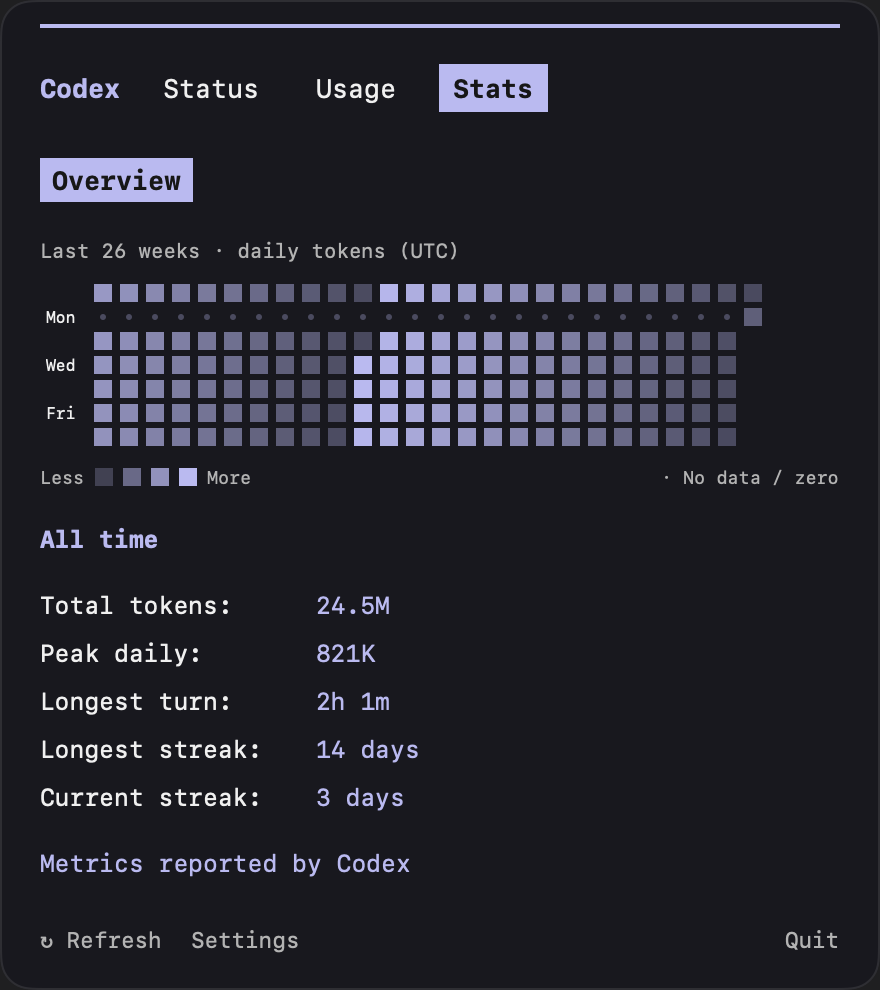
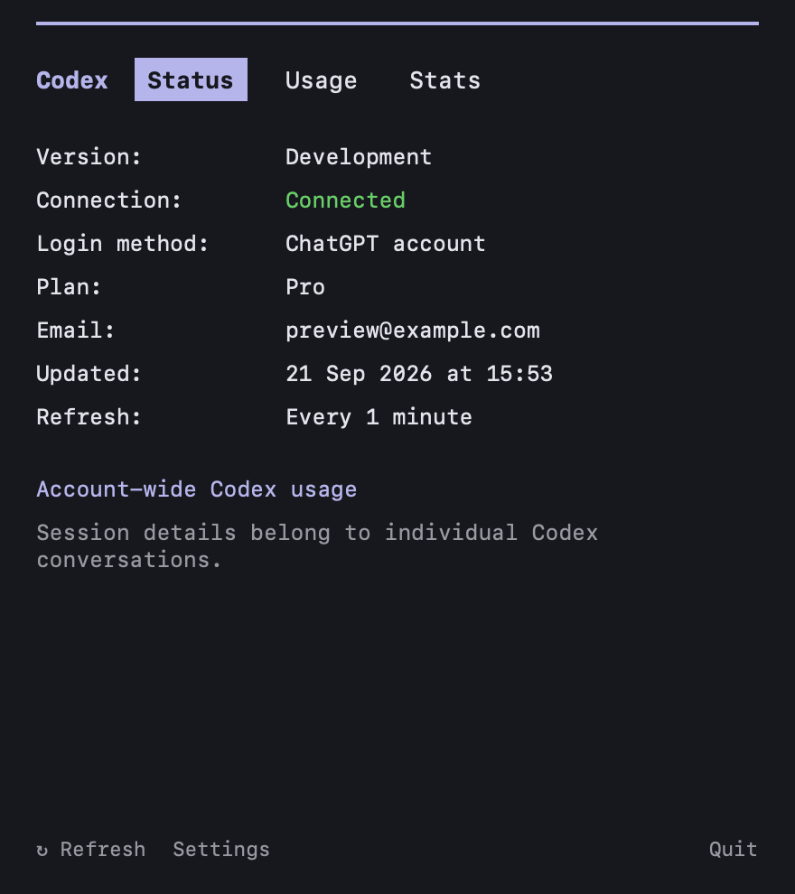
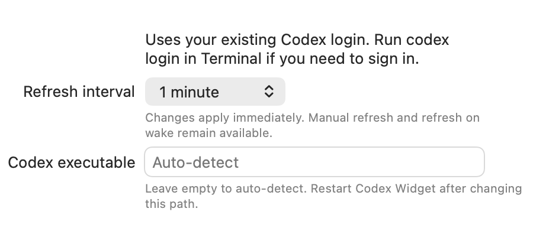

<p align="center"></p>

# Codex Widget

A native macOS menu bar monitor for your existing ChatGPT-backed Codex account. A terminal icon opens a Claude-inspired dark status panel with monospace text and lavender accents.

An unofficial, community-maintained personal project, not affiliated with or endorsed by OpenAI or Anthropic. Compatibility depends on the installed Codex version and the account data its app-server provides.

See [AGENTS.md](AGENTS.md) for architecture, implementation details, UI requirements, data limitations, and maintenance guidance.

## Download

Get the app DMG from the [latest GitHub release](https://github.com/eladhayun/codex-widget/releases/latest). Prebuilt downloads require **Apple Silicon and macOS 14+**, plus an existing signed-in Codex installation.

1. Open the DMG and drag **Codex Widget.app** onto the **Applications** shortcut.
2. Eject the disk image after copying.
3. Open it from Applications and click the terminal icon in the menu bar. There is no Dock icon.
4. If macOS blocks the first launch, use **System Settings → Privacy & Security → Open Anyway** after attempting to open it, if you trust the download. Releases are ad-hoc signed, not notarized.

Each release includes `SHA256SUMS.txt`. Place it beside the downloaded DMG and run `shasum -a 256 -c SHA256SUMS.txt` to verify the disk image. Release notes contain the changelog; automated releases also attach it as `CHANGELOG.md`.

## Screenshots

Actual native panel renders using fictional sample data; no real account information is shown.

| Usage | Stats |
| --- | --- |
|  |  |

<details>
<summary>Status tab</summary>



</details>

<details>
<summary>Settings</summary>



</details>

## Run locally

Requires macOS 14+, Xcode 16+ or Swift 5.9+, and the Codex CLI signed in with `codex login`.

```sh
make test
make build
open "build/Codex Widget.app"
```

Alternatively open `CodexWidget.xcodeproj` in Xcode and run the CodexWidget target. Tests run through `make test` (Swift Package Manager). The app is locally ad-hoc signed and does not need an Apple developer account. It has no Dock icon: click the **terminal icon** in your menu bar to open its status panel. Click Quit in the panel to exit. Launch manually after restarting your Mac.

## How it works

The app starts its own `codex app-server --stdio` process and uses the documented initialization handshake, `account/read`, `account/rateLimits/read`, and `account/usage/read`. It never starts a thread or model turn. Credentials remain managed by Codex; no account data is written by the widget. The app-server itself may update its normal Codex logs/auth cache.

The menu bar shows only a monochrome terminal icon. The panel has three tabs:

- **Status:** Account, plan, connection, last update, and refresh interval.
- **Usage** (default): Account token totals and each quota window, with percentage **used**, lavender bars, and reset times in your local timezone. Weekly windows also include a separate time-remaining bar that decreases toward reset, updated every minute.
- **Stats:** A 26-week UTC daily-token activity grid, lifetime tokens, peak daily tokens, longest turn, and streaks when Codex supplies them. Hover a day for its value; missing days are not assumed to be zero.

The panel intentionally retains the reference's dark appearance in both macOS themes, with purple accents throughout Stats. Token counts are separate activity metrics, not a token-based quota allowance. Date-only daily buckets are matched to UTC and labeled explicitly; the upstream API does not specify a timezone. Missing metrics show **Unavailable**, not zero.

When today's bucket is absent, the panel falls back to **Last 24h**, labeled **This Mac · all local Codex sessions**. This is a rolling total from timestamped OpenAI token-counter events in `CODEX_HOME/sessions` and `archived_sessions` (default `~/.codex`). It includes local sessions across logins, not usage from other devices; it is not the account-wide daily report. Cached input tokens are already included in the reported total and are not added again. The reader processes changed files off the UI thread, deduplicates archived copies, ignores repeated counters and inherited fork history, and never retains or logs conversation text. Partial reads are labeled. If local records are absent, the app keeps **Not reported yet** or **Unavailable**. A returned daily report, including a reported zero, takes priority over the fallback.

Session costs, model breakdowns, and Claude-specific fields are not synthesized from Codex account data.

Choose a refresh interval in Settings: 15 or 30 seconds, or 1, 2, 5, or 15 minutes. The default is 1 minute. Changes are saved and reschedule polling immediately without restarting; an in-flight refresh completes first. The Status tab shows the selected cadence. Refresh also occurs on wake, on opening a stale panel, or via Refresh. Quota notifications trigger a full refresh. Errors retain the last successful snapshot with a stale marker and retries back off from 5 seconds to 5 minutes. An account change clears the previous account's data. Past reset times do not optimistically refill the quota.

Codex is discovered at `/opt/homebrew/bin/codex`, `/usr/local/bin/codex`, the Codex app's bundled executable, or `PATH`. Set a custom executable path in Settings and restart if needed. The app uses the same Codex home/environment as its launched process; Finder launches normally use your default Codex home.

## Build a disk image

```sh
make dmg-tools  # One-time setup of pinned Python packaging tools in build/
make dmg        # Builds build/Codex-Widget.dmg
```

The compressed disk image includes the app, an Applications shortcut, and a custom Finder layout. The mounted volume carries the app icon. Local DMG files also receive a custom Finder icon, but that file metadata is not preserved by direct GitHub downloads; the downloaded file may display the standard DMG icon until opened. It verifies the mounted app's signature, icon, license, and shortcut before completing. `make assets` regenerates the original icon and installer artwork with AppKit; `make screenshots` refreshes the sample-data README images. Both SwiftPM and Xcode builds include the icon and MIT license.

## Automated releases

The [Test and release workflow](.github/workflows/release.yml) runs the full Swift test suite, including native panel renders, for pull requests and every push to `main`. A separate release job runs only after the push's tests pass. It builds on an Apple Silicon macOS runner, packages and verifies a drag-to-Applications DMG, and publishes it with a checksum and changelog.

Tags combine the version in `Resources/Info.plist` with the workflow run number, for example `v0.1.0+build.1`. The app's **Status → Version** displays that exact tag. CI embeds it as `CodexReleaseTag` in the app's plist while keeping the numeric marketing version and bundle build number in the standard macOS keys. Local builds display their plist marketing version; unpackaged SwiftPM runs display `Development`. Every push, including documentation changes, produces a release after successful tests; a failed run can be rerun. Rerunning a published release leaves its assets intact, and an interrupted draft can be completed.

Changelogs list commits since the nearest preceding `v*` tag in the pushed commit's history, with a link to the full diff. Publishing uses GitHub's built-in `GITHUB_TOKEN` with write access only in the release job; no personal token or Apple signing certificate is required. Workflow runs are independent so rapid pushes do not cancel one another.

## Troubleshooting

- **Sign-in required:** Run `codex login` in Terminal, then Refresh. API-key-only logins do not expose ChatGPT-plan quotas.
- **Token activity unavailable:** The account, backend, or installed CLI may not support these metrics. Quotas still work independently.
- **Stale data:** Check network connectivity and your Codex login. The app retains old values visibly marked as stale.
- **CLI compatibility:** Developed against Codex CLI 0.155.1. App-server is versioned with the CLI; update Codex if requests are unsupported.

`make check` performs a live, read-only usage check and prints availability without account identifiers or credentials. No model tasks are created. `make build` produces `build/Codex Widget.app`; copy it to your Applications folder if desired. This personal build is not notarized or intended for App Store distribution.

Tests cover protocol failures, quota calculations, account changes, stale recovery, wake notifications, shutdown, and native offscreen light/dark renders. The render test uses sample data and writes images to `.build/previews/`; it does not capture the desktop. Actual system sleep/resume and menu-bar clicks still warrant a manual smoke check on your Mac.

Protocol reference: https://learn.chatgpt.com/docs/app-server

## License

[MIT](LICENSE) © 2026 Elad Hayun.
